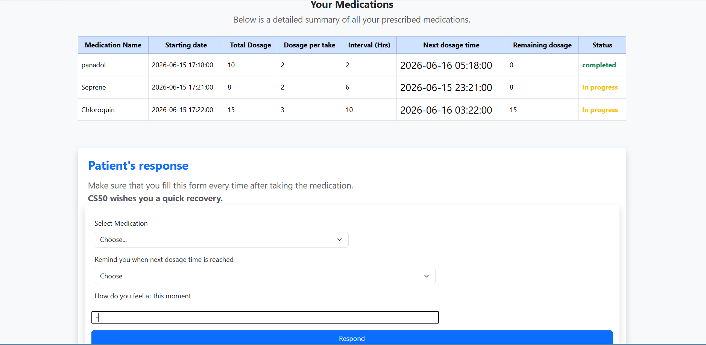
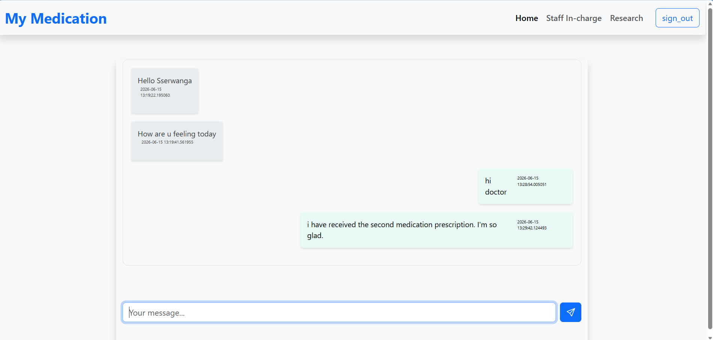
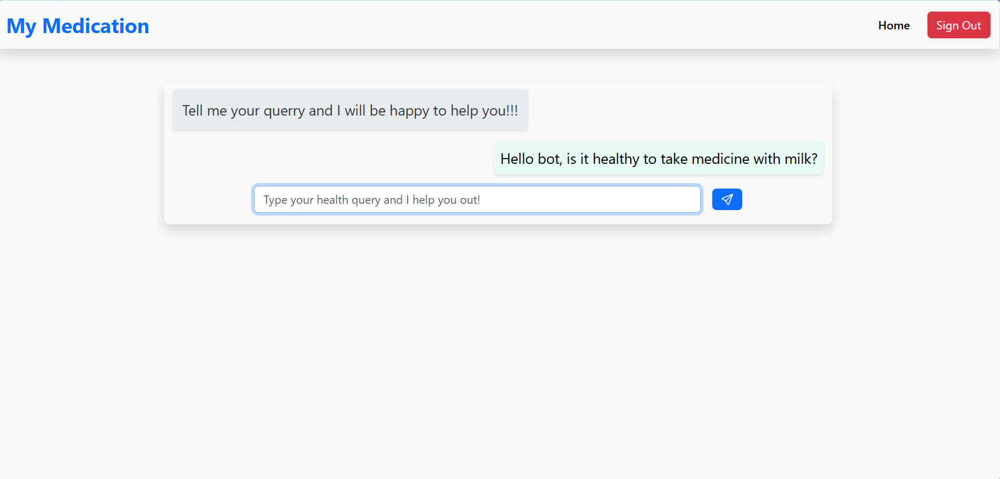

#  Hospital Patient Connect

Hospital Patient Connect is a web-based healthcare monitoring platform designed to improve communication and patient care for individuals receiving treatment at home. The system enables healthcare providers to remotely monitor patient recovery, respond to emergencies, and maintain real-time communication with patients.

The platform also integrates AI-assisted medical search capabilities to provide basic diagnostic guidance and health information.

##  Features

* 📈 Remote monitoring of home-treated patients
* 💬 Real-time chat between patients and healthcare providers
* 🤖 AI-powered medical assistance and symptom guidance
* 🚨 Emergency reporting and alert system
* 👥 Secure user authentication and management
* 📊 Centralized patient data management
* ⚡ Real-time communication using Socket.IO

## 🛠️ Technology Stack

### Backend

* Flask
* Python
* Flask-SocketIO

### Frontend

* HTML
* CSS
* JavaScript

### Database

* MySQL

### Real-Time Communication

* Socket.IO
  

### AI Integration 

* AI-powered medical search and diagnostic assistance

## 📷 Demo

Watch the live project demonstration on YouTube:

[🔗 YouTube Demo] https://www.youtube.com/watch?v=X87nDdr1t8s

##  System Overview

The platform connects patients and healthcare providers through a centralized system that supports:

* Patient health monitoring
  
* Recovery progress tracking
* Real-time messaging
   
* Emergency notifications
* AI-assisted healthcare support
  

##  Installation

### Clone the repository

```bash
git clone https://github.com/your-username/Hospital_Patient_Connect.git
cd Hospital_Patient_Connect
```
### Installation
```pip install -r requirements.txt```


### Configure SQLite Database

Update your database configuration settings in the application before running the server.

### Run the application

```bash
flask run
```

##  Project Objectives

* Improve monitoring of patients receiving treatment at home
* Enhance communication between patients and healthcare providers
* Enable quick responses to emergency situations
* Reduce unnecessary hospital visits
* Support healthcare delivery through intelligent technologies

##  Future Improvements

* Video consultation support
* Mobile application version
* Integration with wearable health devices
* Advanced AI health analytics
* Electronic Medical Records (EMR) integration

##  Contributing

Contributions are welcome. Feel free to fork the repository, create a feature branch, and submit a pull request.

##  License

This project is licensed under the MIT License.

##  Author

**Sserwanga Edirisa**

Backend Developer | Full-Stack Development Enthusiast

---

*Building smarter healthcare solutions through connected patient monitoring.*
